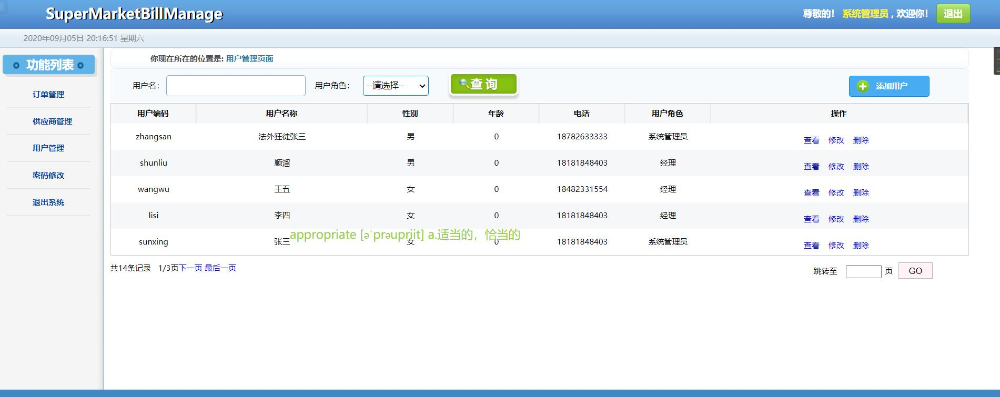

# smbms-servlet
## 该项目是一个 超时订单后台管理系统，是一个基于servlet 开发的Java web项目
### 技术选型
+ 前端： html+ css+ JavaScript + jQuery + BootStrap 
+ 异步通信技术Ajax 交换数据格式 json
+ 后端： java + Fastjson + jdbc + Maven
+ 容器：Tomcat

### 角色分级：系统管理员、经理、员工

---
### 功能
+ 登录
+ 退出
+ 密码修改
+ 用户管理：CRUD
+ 供应商管理：CRUD
+ 订单管理：CRUD

---
### 用户管理模块--视图预览

